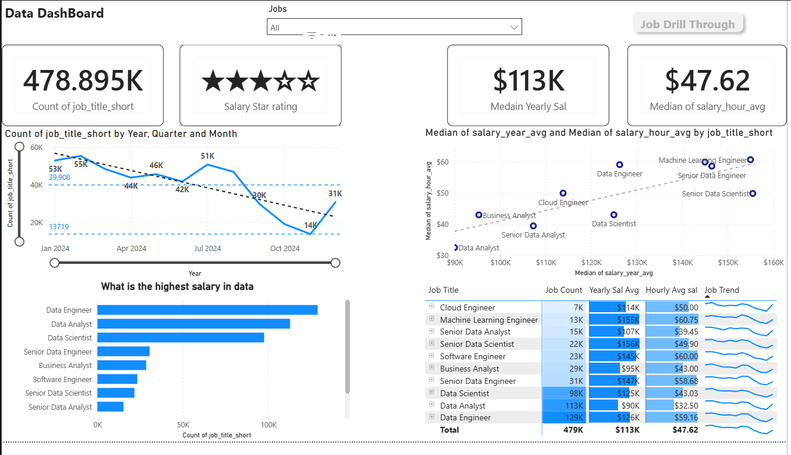

# 📊 Power BI Data Jobs Dashboard

## 📌 Project Overview
This project is an interactive **Power BI dashboard** that analyzes **data-related job roles**, salary trends, and hiring demand.  
It provides insights into job counts, median salaries, hourly rates, and trends over time across various data roles.

This dashboard is useful for:
- Job seekers exploring salary benchmarks
- Data analysts studying job market trends
- Recruiters and stakeholders comparing roles

---

## 🧩 Key Features
- Total job count analysis (~479K records)
- Median yearly and hourly salary insights
- Salary comparison by job title
- Job trends by year, quarter, and month
- Job drill-through functionality
- Salary star rating metric

---

## 📈 Dashboard Highlights
- **Median Yearly Salary:** $113K  
- **Median Hourly Salary:** $47.62  
- **Top Paying Roles:**
  - Machine Learning Engineer
  - Senior Data Scientist
  - Software Engineer
- Clear visualization of job demand fluctuations over time

---

## 🛠 Tools & Technologies
- Power BI
- DAX
- Power Query
- Data Modeling
- Git & GitHub

---

## 📂 Repository Structure
```text
│── Data_Jobs_Dashboard.pbix
├── Images/
│   └── dashboard_overview.png
└── README.md
```



<p align="center">
  
</p>


